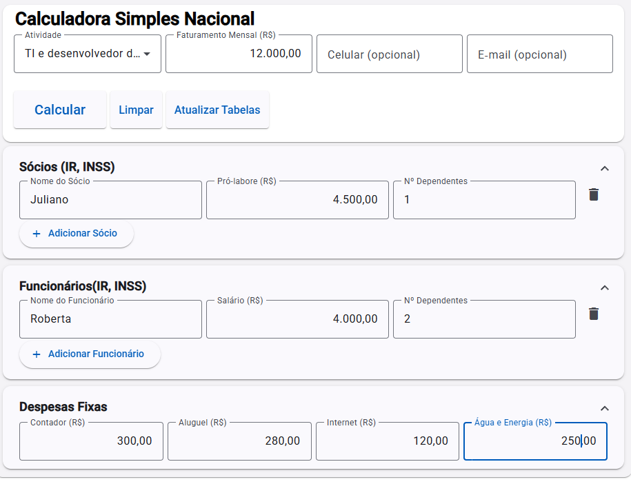
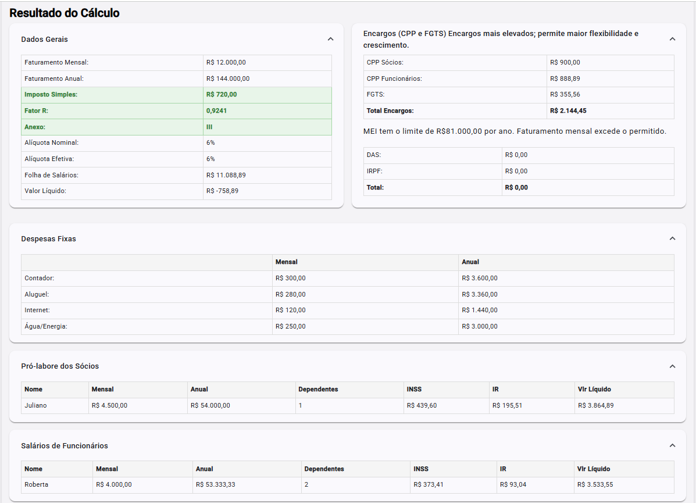

# 📊 Calcula Tributos Simples Nacional

Aplicação desenvolvida em **Angular 19** que realiza o cálculo de tributos no regime do **Simples Nacional**, considerando:

- **Fator R**
- **Anexos III e V**
- **Cálculo de pró-labore (INSS e IR) dos sócios**
- **Funcionários (INSS e IR)**
- **Despesas fixas (contador, aluguel, internet, água e energia)**
- **Encargos previdenciários (CPP, FGTS)**
- Comparativo com modelo **MEI**

---

## 🖼️ **Screenshots**

### 🔸 Tela Principal


### 🔸 Resultado do Cálculo


---

## 🚀 **Tecnologias Utilizadas**

- ✅ Angular **19**
- ✅ Angular Material
- ✅ TypeScript
- ✅ RxJS
- ✅ SCSS
- ✅ ngx-mask
- ✅ ngx-currency
- ✅ API REST em **.NET 8** (backend próprio — não incluso neste repositório)

---

## 🏗️ **Funcionalidades Implementadas**

- 🔸 Cálculo automático do **Simples Nacional**
- 🔸 Avaliação do **Fator R** (Anexo III ou V)
- 🔸 Simulação de **encargos previdenciários** (CPP, FGTS)
- 🔸 Cálculo detalhado de **INSS e IR** para sócios e funcionários
- 🔸 Permite adicionar múltiplos sócios e funcionários
- 🔸 Avaliação comparativa com **MEI**
- 🔸 Interface 100% responsiva, com Material Design
- 🔸 Tela de manutenção de tabelas (alíquotas, INSS, IR)

---

## 📦 **Instalação e Execução Local**

### 🔧 **Pré-requisitos**
- Node.js >= 18
- Angular CLI >= 19

### ▶️ **Passos para rodar local**

```bash
# Clone este repositório
git clone https://github.com/JulianoPS/calcula-tributos-simples-nacional.git

# Acesse a pasta do projeto
cd calcula-tributos-simples-n
```

## 📬 Contato
- 🔗 **LinkedIn:** [linkedin.com/in/julianopereiradossantos]( https://www.linkedin.com/in/julianopereiradossantos )  
- ✉️ **Email:** juliano@email.com  
- 🐙 **GitHub:** [github.com/JulianoPS]( https://github.com/JulianoPS )
